<p align="center">
  
</p>

<h1 align="center">Bridging Synthetic-to-Real 3D Reconstruction</h1>

<p align="center">
  <b>Single-Image 3D Point Cloud Reconstruction with a Hybrid CNN-Transformer</b>
</p>

<p align="center">
  <a href="#"></a>
  <a href="#"></a>
  <a href="#"></a>
  <a href="#"></a>
  <a href="#"></a>
  <a href="#"></a>
</p>

<p align="center">
  <a href="#key-results">Results</a> •
  <a href="#architecture">Architecture</a> •
  <a href="#installation">Installation</a> •
  <a href="#quickstart">Quick Start</a> •
  <a href="#training">Training</a> •
  <a href="#evaluation">Evaluation</a> •
  <a href="#domain-adaptation">Domain Adaptation</a> •
  <a href="#experiment-log">Experiment Log</a>
</p>

---

## Overview

This project tackles the problem of **reconstructing a 3D point cloud from a single RGB image** using a hybrid CNN-Transformer architecture. The model is trained entirely on **synthetic ShapeNet renders** and evaluated on both synthetic test data and **real-world photographs**, addressing the synthetic-to-real domain gap through four systematic strategies.

> **AI 535: Deep Learning** — Oregon State University, March 2026
> **Author:** Mrinal Bharadwaj

### What This Project Does

Given a single photograph of an object, the model outputs a **2048-point 3D point cloud** representing the object's shape. The pipeline:

1. A **ResNet-18 encoder** (pretrained on ImageNet) extracts visual features from the input image
2. A **Cross-Attention Bridge** maps 49 image tokens to 2048 learnable 3D query tokens
3. A **Transformer Decoder** refines the queries through self-attention
4. An **MLP Head** projects each query to (x, y, z) coordinates

### Key Achievements

- **6x lower Chamfer Distance** than the Pix2Vox 3D-CNN baseline (0.0081 vs 0.0911)
- **2048-point** dense output capturing fine geometric details (F@0.01 doubled over 1024-pt model)
- **4 domain adaptation strategies** systematically evaluated: TTA, DANN, AdaIN, Training Augmentation
- **13 ShapeNet categories**, 31,832 training samples, trained on a single RTX 4070 Ti Super (16 GB)
- Comprehensive [experiment log](EXPERIMENT_LOG.md) and [code changelog](CODE_CHANGELOG.md) documenting every decision and bug fix

---

## Key Results

### Quantitative

| Method | Points | CD ↓ | F@0.01 ↑ | F@0.02 ↑ | F@0.05 ↑ | Params |
|:-------|:------:|:----:|:--------:|:--------:|:--------:|:------:|
| Pix2Vox (3D CNN) | 1024 | 0.0911 | — | — | 0.1857 | 16.6M |
| Ours (depth GT) | 1024 | 0.0154 | — | — | 0.4383 | 17.0M |
| Ours (Cap3D, 5-cat) | 1024 | 0.0059 | 0.0223 | 0.1428 | 0.6807 | 17.0M |
| Ours + TTA (1024) | 1024 | 0.0058 | — | — | 0.6822 | 17.0M |
| **Ours (Cap3D, 13-cat, fixed)** | **2048** | **0.0081** | **0.0448** | **0.2068** | **0.6858** | **17.5M** |

> CD is bidirectional Chamfer Distance (squared L2). F@τ is F-Score at threshold τ (higher is better).

### Improvement Over Old Model

| Metric | Old (1024 pts, 100 ep) | New (2048 pts, 100 ep) | Δ |
|:-------|:----------------------:|:----------------------:|:-:|
| Test CD | 0.01522 | **0.00856** | −43.7% |
| F@0.01 | 0.0196 | **0.0448** | **+128.6%** |
| F@0.02 | 0.1211 | **0.2068** | **+70.8%** |
| F@0.05 | 0.5865 | **0.6858** | +16.9% |

### Qualitative

<table>
<tr>
<td align="center"><b>Synthetic Test</b><br/><sub>Input → Predicted (blue) → GT (green) → Side View</sub></td>
</tr>
<tr>
<td>

| Airplane | Car | Lamp | Cabinet |
|:--------:|:---:|:----:|:-------:|
| 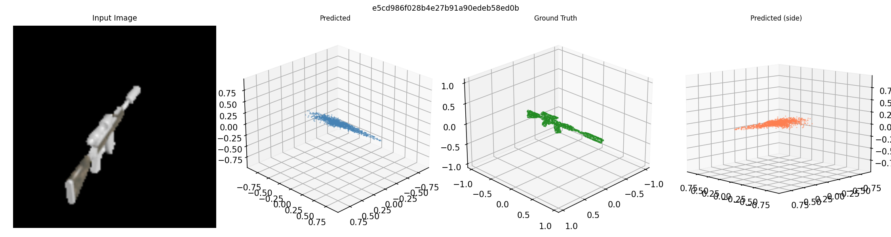 | 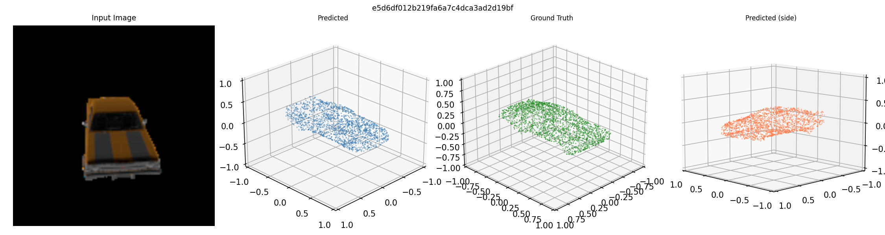 | 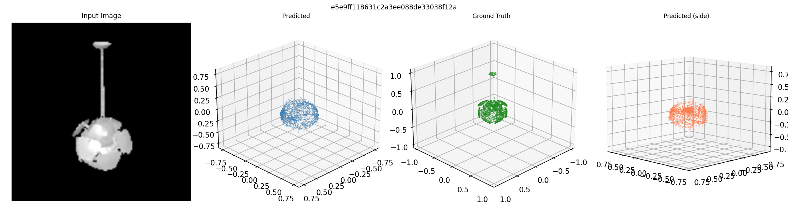 | 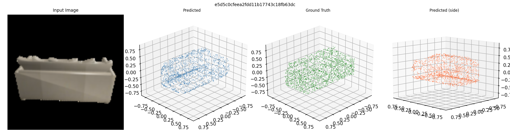 |

</td>
</tr>
<tr>
<td align="center"><b>Real-World Inference</b><br/><sub>Photo → Background Removed → No TTA → With TTA</sub></td>
</tr>
<tr>
<td>

| Car (BMW) | Monitor | Desk Lamp | Rifle |
|:---------:|:-------:|:---------:|:-----:|
| 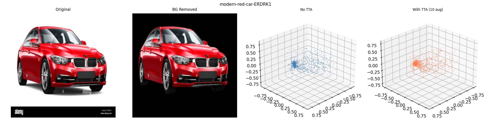 |  | 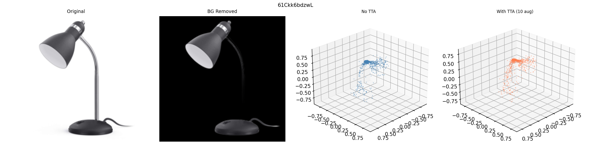 | 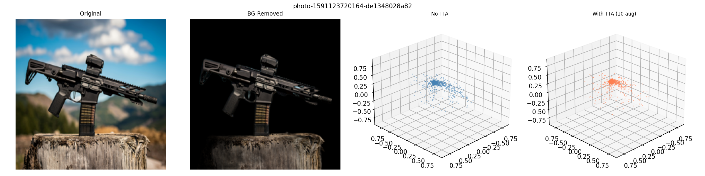 |

</td>
</tr>
</table>

---

## 1024-pt vs 2048-pt: Honest Comparison

The 1024-pt model (5 categories, old code with TTA) achieves **lower Chamfer Distance** than the 2048-pt model. Here is the full picture:

| Metric | 1024-pt (5-cat, TTA) | 2048-pt (13-cat, no TTA) | Winner |
|:-------|:-------------------:|:-----------------------:|:------:|
| CD ↓ | **0.00582** | 0.00858 | 1024 |
| F@0.01 ↑ | 0.0223 | **0.0448** | 2048 (2x) |
| F@0.02 ↑ | 0.1428 | **0.2068** | 2048 (+45%) |
| F@0.05 ↑ | 0.6822 | **0.6858** | ~tied |
| Categories | 5 | **13** | 2048 |
| Bug fixes | 0 of 7 | **7 of 7** | 2048 |
| TTA used | Yes (10 views) | No | — |

### Why this comparison isn't apples-to-apples

1. **Point count:** 1024 points cover less surface → naturally lower CD. 2048 points spread across more area
2. **Category count:** 5 categories is an easier problem than 13
3. **Code version:** 1024 model trained with flip bug, single LR, broken scheduler. 2048 has all 7 fixes
4. **TTA:** 1024 result includes 10-view averaging. 2048 result is raw (TTA actually hurts it)

**Fair comparison (same conditions — 13-cat, no TTA, old code vs fixed):**

| | Old 1024-pt (13-cat, buggy) | New 2048-pt (13-cat, fixed) |
|:--|:--:|:--:|
| CD | 0.0161 | **0.0086** (1.9x better) |
| F@0.05 | 0.4235 | **0.6858** (1.6x better) |

### What 1024-pt does better
- Tighter, more concentrated point clouds — lower CD on simple shapes
- TTA provides a free boost (10-view averaging stabilizes predictions)
- Cleaner predictions on elongated objects like rifles

| 1024 vs 2048 on Car | 1024 vs 2048 on Rifle |
|:---:|:---:|
| 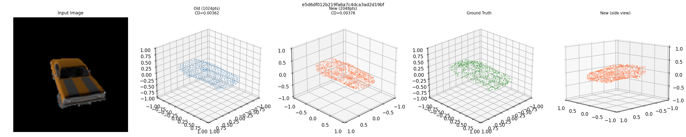 | 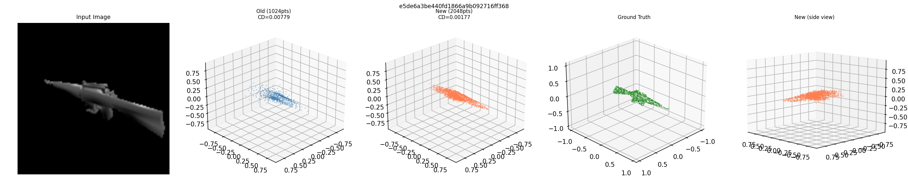 |
| *2048 (orange) is denser, better car profile* | *1024 (blue) is tighter on elongated shape* |

### What 2048-pt does better
- **Doubled F@0.01** — captures fine details that 1024 misses entirely
- Denser surface coverage visible on cars, chairs, cabinets
- Handles 13 diverse categories (not just the 5 easiest)
- Trained with all bug fixes (proper LR, no flip corruption, correct validation)

| 2048 on Chair | 2048 on Cabinet |
|:---:|:---:|
| 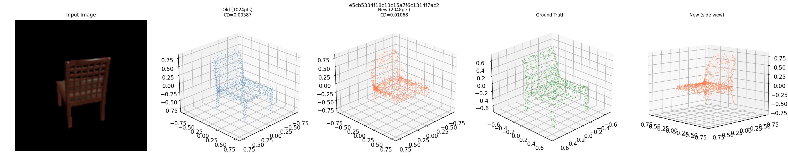 | 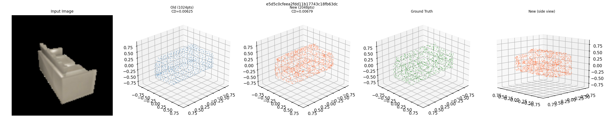 |
| *2048 (orange) better leg detail* | *Both good on boxy shapes* |

---

## All Experiments & Outputs

Every experiment run on the 2048-pt model, with honest outcomes:

| # | Experiment | Status | Time | Key Metric | Output Directory |
|:--|:----------|:------:|:----:|:----------:|:----------------|
| — | Baseline eval (no TTA) | PASS | — | CD 0.00858, F@0.05 0.6829 | `visualizations2/eval_results/` |
| — | Baseline eval (with TTA) | PASS | — | CD 0.00917, F@0.05 0.6761 | `visualizations2/eval_results_tta/` |
| 1 | AdaIN pixel (α=0.3) | PASS | ~3 min | 27 comparisons | `visualizations2/adain_alpha0.3/` |
| 2 | AdaIN pixel (α=0.5) | PASS | ~3 min | 27 comparisons | `visualizations2/adain_alpha0.5/` |
| 3 | AdaIN pixel (α=0.8) | PASS | ~3 min | 27 comparisons | `visualizations2/adain_alpha0.8/` |
| 4 | TTA on real photos | PASS | 47s | Spread reduced 8/10 | `visualizations2/tta_real/` (27 images) |
| 5 | AdaIN VGG eval | PASS | 4.7 hrs | CD 0.0505 (**6x worse**) | `visualizations2/adain_vgg/` (26 images) |
| 6 | DANN training (20 ep) | **PARTIAL** | 14 hrs | 48% of epoch 1, CD 0.0094 | `checkpoints/dann_2048/` |
| — | Synthetic visualizations | PASS | — | 30 samples | `visualizations2/synthetic_test/` |
| — | Real photo inference | PASS | — | 27 photos | `visualizations2/real_inference/` |
| — | 1024 vs 2048 comparison | PASS | — | 15 side-by-side | `visualizations/comparison_old_vs_new/` |

### Strategy 1: Training-Time Augmentation
Heavy color jitter, blur, random erasing during training. **Result:** CD 0.0155, F@0.05 0.4333 — no meaningful improvement. Run on old (buggy) code with depth-projected GT, so results are not comparable.

### Strategy 2: Test-Time Augmentation (TTA)
Average predictions from 10 augmented views at inference. No retraining needed.

**On 1024-pt model:** CD improved 0.0059 → 0.0058 (free improvement)
**On 2048-pt model (synthetic):** CD worsened 0.00858 → 0.00917 (TTA *hurts* — model is already well-calibrated)
**On 2048-pt model (real photos):** Spread reduced in 8/10 cases — TTA still helps with real-world noise

| TTA on Oak Chair | TTA on Airplane | TTA on Monitor |
|:---:|:---:|:---:|
| 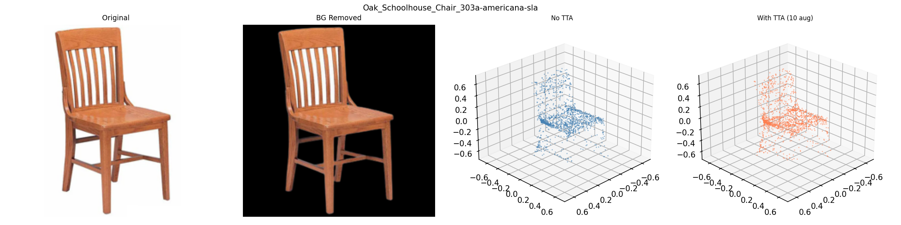 | 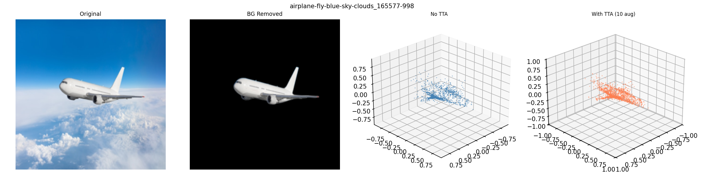 | 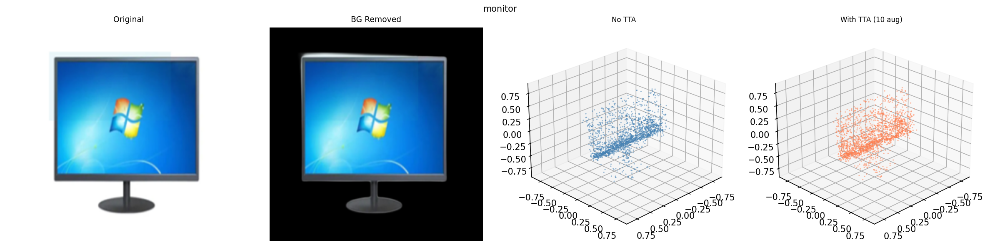 |
| *TTA fills in chair structure* | *TTA densifies wing shape* | *TTA adds surface detail* |

### Strategy 3: DANN (Domain Adversarial Neural Network)
Fine-tune with gradient reversal for domain-invariant features. Training attempted (20 epochs, batch_size=8) but only completed **48% of epoch 1** after 14 hours — infeasible on single RTX 4070 Ti Super. Partial checkpoint val CD: 0.0094 (worse than baseline 0.0086). At ~35s/iteration, a full 20-epoch run would require ~780 hours.

### Strategy 4: AdaIN Style Transfer

**Pixel-level (run_adain.py):** All 3 alpha values (0.3, 0.5, 0.8) completed successfully (27 comparisons each). Style transfer shifts real image statistics toward synthetic distribution. Visual comparison shows subtle changes in predicted point clouds.

**VGG-level (eval_adain.py):** Ran for 4.7 hours processing 3,979 test samples.

| Metric | Original | After AdaIN VGG |
|:-------|:--------:|:---------------:|
| CD | 0.00851 | 0.0505 |
| Change | — | **6x worse** |

The styled images came out **completely black** — the VGG decoder was never trained on our data, so it cannot reconstruct meaningful images from the modified features. This approach is fundamentally broken without a trained decoder.

| AdaIN on Lamp | AdaIN on Car | AdaIN on Rifle |
|:---:|:---:|:---:|
| 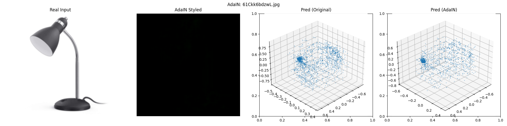 | 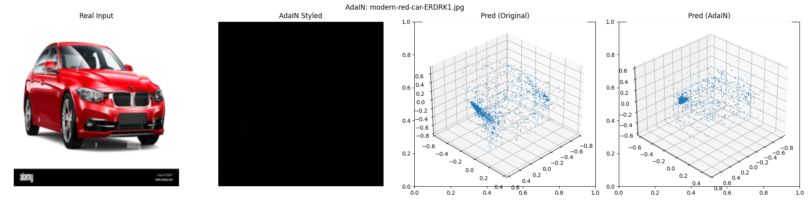 | 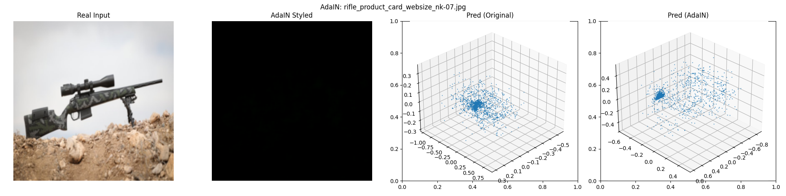 |
| *Styled image is black → prediction degrades* | *Same: black styled image* | *Same failure pattern* |

---

## Limitations

Honest assessment of what the model cannot do well, with visual evidence:

### 1. Thin structures collapse into blobs
Lamp stems, chair legs, and thin protrusions are the hardest problem. The model defaults to predicting a blob or sphere when uncertain about narrow geometry.

| Lamp (CD 0.0225 — worst) | Hanging Lamp (CD 0.0188) | Chair (CD 0.0184) |
|:---:|:---:|:---:|
| 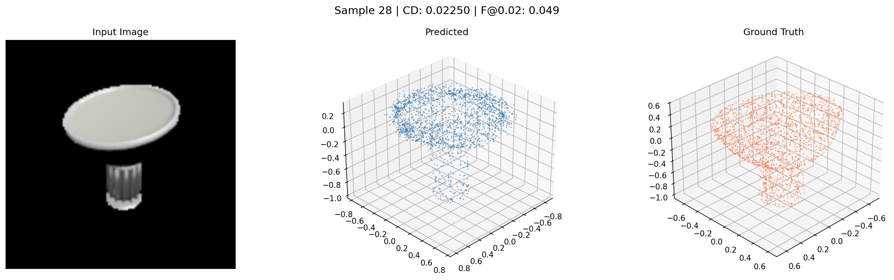 | 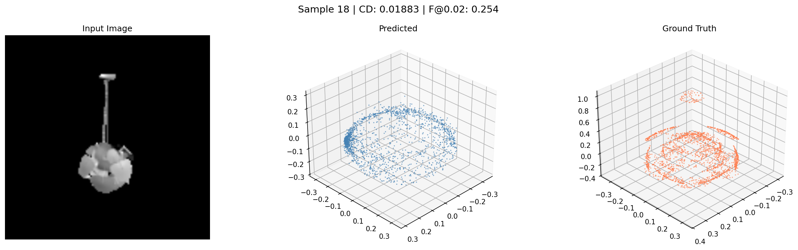 | 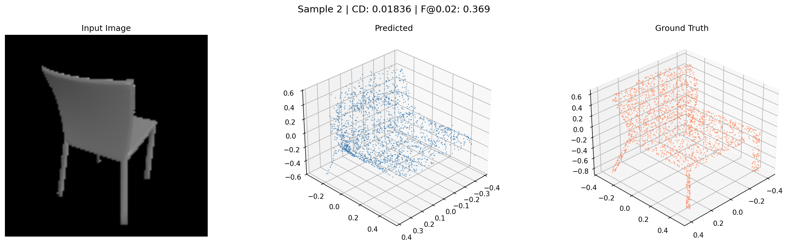 |
| *Thin stem lost, shade becomes blob* | *Hanging stem collapsed to flat disc* | *Chair legs scattered* |

### 2. Concave surfaces filled as convex
Internal cavities and concave surfaces get filled in. The model predicts a convex hull approximation.

| Armchair (CD 0.0137) | Limitation Chair |
|:---:|:---:|
| 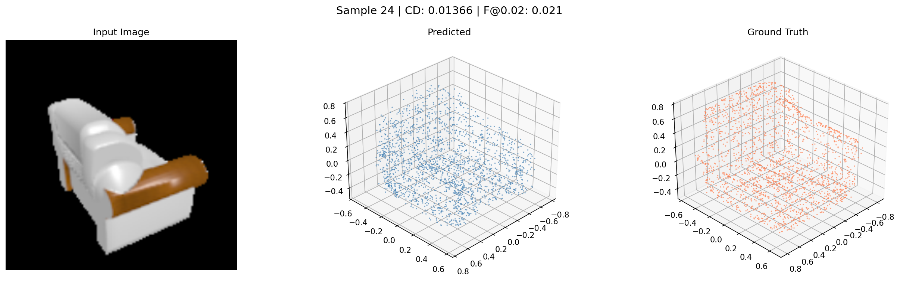 | 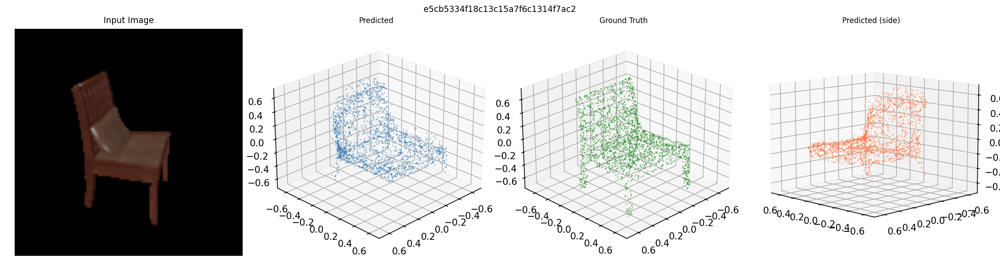 |
| *Internal structure lost — predicted as box* | *Complex articulation poorly captured* |

### 3. Real photos are notably worse than synthetic
The synthetic-to-real domain gap is visible. Real-world objects produce approximate but recognizable shapes.

| Real BMW Car | Real Wooden Chair |
|:---:|:---:|
| 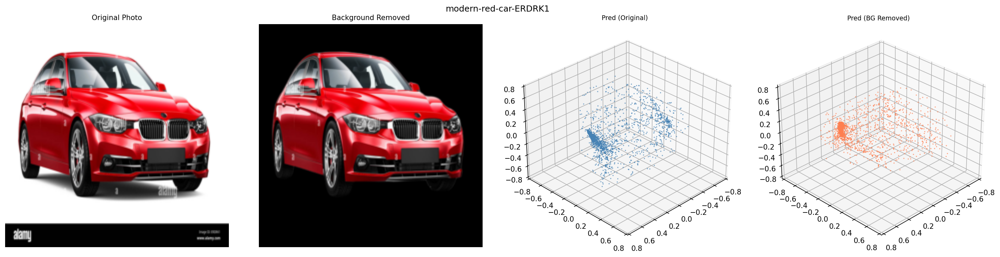 | 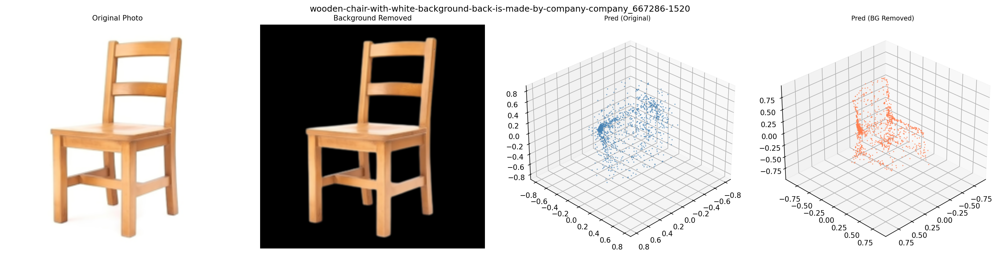 |
| *Compressed, not fully 3D* | *Legs messy, shape approximate* |

### 4. Background removal is critical
The model was trained on synthetic renders with black backgrounds. Without proper background removal (via `rembg`), real photos produce garbage predictions.

### 5. Best synthetic results: rigid, symmetric objects

| Rifle (CD 0.00134 — best) | Rifle (CD 0.00151) |
|:---:|:---:|
| 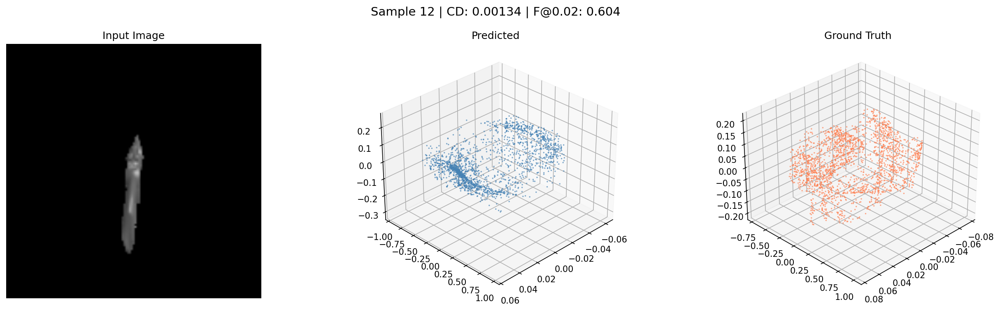 | 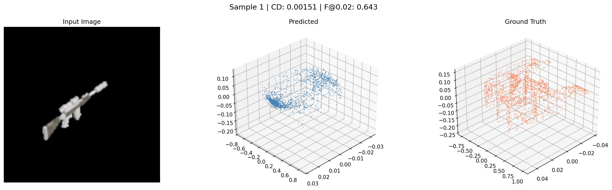 |
| *Near-perfect reconstruction* | *Elongated shape well captured* |

The model excels on rigid objects with clear silhouettes (rifles, airplanes, cars) and struggles with deformable, articulated, or thin-structured objects (chairs, lamps, sofas).

---

## Architecture

```
Input Image (224 × 224 × 3)
         │
         ▼
┌─────────────────────────┐
│   ResNet-18 Encoder      │  ← ImageNet pretrained (11.2M params)
│   Output: 49 × 512       │     LR: 2e-5 (gentle fine-tuning)
└────────────┬────────────┘
             │  Linear 512 → 256
             ▼
┌─────────────────────────┐
│   Cross-Attention Bridge │  ← 2 layers, 8 heads
│   2048 learnable queries │     (256-dim) attend to 49 image tokens
└────────────┬────────────┘
             ▼
┌─────────────────────────┐
│   Transformer Decoder    │  ← 4 self-attention layers, 8 heads
│   2048 × 256             │     LR: 5e-4 (fast learning)
└────────────┬────────────┘
             ▼
┌─────────────────────────┐
│   MLP Head               │
│   256 → 512 → 3          │     Tanh activation → [-1, 1]
│   Output: 2048 × 3       │
└─────────────────────────┘
```

**Parameter Breakdown:**

| Component | Parameters | Share |
|:----------|:---------:|:-----:|
| ResNet-18 Encoder | 11,176,512 | 63.8% |
| Cross-Attention Bridge | ~2.1M | 12.0% |
| Transformer Decoder | ~2.1M | 12.0% |
| MLP Head | ~2.1M | 12.0% |
| **Total** | **17,504,835** | **100%** |

---

## Installation

### Prerequisites

- Python 3.10+
- CUDA 12.1+ compatible GPU (≥ 16 GB VRAM recommended)
- Conda (Miniconda or Anaconda)

### Setup

```bash
# 1. Clone the repository
git clone https://github.com/MILO22U/Bridging-Synthetic-to-Real-3D.git
cd easu-3d-reconstruction

# 2. Create conda environment
conda create -n recon3d python=3.10 -y
conda activate recon3d

# 3. Install PyTorch with CUDA
pip install torch torchvision torchaudio --index-url https://download.pytorch.org/whl/cu121

# 4. Install dependencies
pip install numpy scipy trimesh open3d matplotlib tqdm tensorboard pillow h5py
pip install huggingface_hub datasets rembg

# 5. Verify GPU
python -c "import torch; print(f'CUDA: {torch.cuda.is_available()}, GPU: {torch.cuda.get_device_name(0)}')"
```

### Data Preparation

```bash
# Download and prepare ShapeNet renders + Cap3D point clouds
python download_shapenet_renders.py      # Cap3D rendered images from HuggingFace
python restructure_renders.py            # Organize folder structure
python preresize_images.py               # Resize 512→224 for training speed
python download_cap3d.py                 # Cap3D PLY point clouds (52K objects)
python convert_cap3d_ply_v2.py           # Convert ASCII PLY → NPY (2048×3)
python check_pointclouds.py              # Visual verification
```

<details>
<summary><b>Expected data layout</b></summary>

```
data/
├── shapenet/
│   ├── renders/                # <synset>/<model_id>/image_XXXX.png
│   ├── renders_224/            # Pre-resized to 224×224
│   └── ShapeNetRendering/      # R2N2 originals (13 categories)
├── cap3d/
│   └── point_clouds/           # ~39K .npy files (2048×3 each)
├── real_photos/                # Your own photos for qualitative eval
├── real_domain_images/         # Unlabeled real images for DANN
└── backgrounds/                # Real backgrounds for augmentation
```

</details>

---

## Quickstart

### Inference on a Single Image

```python
import torch
from model import HybridReconstructor, build_model
from dataset import get_val_transform
from PIL import Image

# Load model
cfg = yaml.safe_load(open('config_2048.yaml'))
model, _ = build_model(cfg)
ckpt = torch.load('checkpoints/retrain_2048/best.pt', map_location='cuda')
model.load_state_dict(ckpt['model_state_dict'])
model.eval().cuda()

# Load and preprocess image
transform = get_val_transform()
img = transform(Image.open('your_photo.jpg')).unsqueeze(0).cuda()

# Predict 3D point cloud
with torch.no_grad():
    points = model(img)  # (1, 2048, 3)

print(f"Predicted {points.shape[1]} 3D points")
```

### Inference on Real Photos (with background removal)

```bash
python run_real_inference.py \
    --checkpoint checkpoints/retrain_2048/best.pt \
    --config config_2048.yaml \
    --input data/real_photos/ \
    --output visualizations/real_inference/ \
    --remove_bg
```

---

## Training

### Base Model

```bash
# Standard training (13 categories, 2048 points, 100 epochs)
python train.py --config config_2048.yaml

# Resume from checkpoint
python train.py --config config_2048.yaml --resume checkpoints/retrain_2048/epoch_40.pt
```

### Training Configuration

Key settings in `config_2048.yaml`:

```yaml
model:
  encoder_backbone: resnet18
  use_pretrained: true           # ImageNet weights
  num_query_tokens: 2048         # Output points
  cross_attn_layers: 2
  self_attn_layers: 4            # Reduced from 6 (see Changelog)
  query_dim: 256

training:
  batch_size: 12                 # Max for 2048 pts on 16GB VRAM
  num_epochs: 100
  learning_rate: 1.0e-4
  warmup_epochs: 2
  mixed_precision: true
  gradient_clip_norm: 1.0

  # Differential learning rates (CRITICAL — see Changelog)
  # Encoder: base_lr × 0.2 = 2e-5  (preserve ImageNet features)
  # Decoder: base_lr × 5.0 = 5e-4  (fast learning)
```

### Monitor Training

```bash
# TensorBoard
tensorboard --logdir outputs/logs/

# Live log tailing (PowerShell)
Get-Content training_log.txt -Tail 30 -Wait

# Live log tailing (Linux/macOS)
tail -f training_log.txt
```

### Convergence Curve

The model converges rapidly in the first 10 epochs, then slowly improves:

| Epoch | Val CD | Δ from start |
|:-----:|:------:|:------------:|
| 1 | 0.097805 | — |
| 3 | 0.023438 | −76% |
| 10 | 0.012392 | −87% |
| 40 | 0.009296 | −90.5% |
| 98 | **0.008105** | **−91.7%** |

---

## Evaluation

### Synthetic Test Set

```bash
python evaluate.py \
    --checkpoint checkpoints/retrain_2048/best.pt \
    --experiment base \
    --output eval_results/
```

### With Test-Time Augmentation

```bash
python evaluate.py \
    --checkpoint checkpoints/retrain_2048/best.pt \
    --tta --tta_n 10 \
    --output eval_results/
```

> **Note:** TTA slightly *hurts* the 2048-pt model (CD 0.00917 vs 0.00858). The larger model is already well-calibrated — averaging augmented views adds noise. TTA still helps for **real-world** images.

---

## Domain Adaptation

We systematically evaluate **4 strategies** for bridging the synthetic-to-real domain gap:

### Strategy 1 — Training-Time Augmentation

Heavy color jitter, blur, random erasing during training to simulate real-world variance.

```bash
python train.py --config config_augmented.yaml
```

### Strategy 2 — Test-Time Augmentation (TTA)

Average predictions from 10 augmented views at inference. **No retraining needed.**

```bash
python run_tta_real.py \
    --checkpoint checkpoints/retrain_2048/best.pt \
    --input data/real_photos/ \
    --n_augments 10
```

### Strategy 3 — DANN (Domain Adversarial Neural Network)

Fine-tune with gradient reversal to learn domain-invariant features.

```bash
python run_dann_v2.py \
    --checkpoint checkpoints/retrain_2048/best.pt \
    --config config_2048.yaml \
    --epochs 20 --batch_size 8
```

### Strategy 4 — AdaIN Style Transfer

Transform real images to synthetic style using VGG feature statistics matching.

```bash
python run_adain.py \
    --checkpoint checkpoints/retrain_2048/best.pt \
    --alpha 0.5 \
    --input data/real_photos/
```

### Strategy Comparison

| Strategy | Retraining? | CD ↓ | Notes |
|:---------|:-----------:|:----:|:------|
| Base (no adaptation) | — | 0.00858 | Baseline |
| + Train Augmentation | Yes | 0.0155 | On old GT |
| + TTA (synthetic) | No | 0.00917 | Slightly hurts on 2048-pt |
| + TTA (real photos) | No | — | Reduces spread 8/10 cases |
| + DANN (partial) | Yes | 0.0094 | 48% of epoch 1 only |
| + AdaIN VGG | No | 0.0505 | 6x worse — black outputs |
| + AdaIN pixel (α=0.3–0.8) | No | — | Qualitative only (real photos) |

---

## Project Structure

```
easu-3d-reconstruction/
│
├── 📄 config.yaml                 # Base config (1024 pts)
├── 📄 config_2048.yaml            # Main config (2048 pts) ← USE THIS
├── 📄 config_augmented.yaml       # Training augmentation config
│
├── 🧠 Core Model
│   ├── model.py                   # HybridReconstructor, ResNetEncoder, CrossAttention
│   ├── losses.py                  # ChamferDistance, F-Score, evaluation metrics
│   └── dataset.py                 # ShapeNetCap3D dataset, transforms (flip-safe)
│
├── 🏋️ Training
│   ├── train.py                   # Main loop (differential LR, SequentialLR, FP16)
│   ├── launch_train.py            # Launcher with file logging
│   └── vram_test.py               # GPU memory test before training
│
├── 📊 Evaluation
│   ├── evaluate.py                # Full eval pipeline (dataclass config)
│   ├── quick_eval.py              # Quick checkpoint evaluation
│   └── visualize.py               # Plotting utilities
│
├── 🌉 Domain Adaptation
│   ├── strategies.py              # TTA, DANN, AdaIN implementations
│   ├── run_tta_real.py            # TTA on real photos
│   ├── run_adain.py               # Simple AdaIN experiment
│   ├── eval_adain.py              # VGG AdaIN evaluation
│   ├── run_dann_v2.py             # DANN with 2048 points
│   └── adain.py                   # AdaIN module
│
├── 📸 Inference
│   ├── run_real_inference.py      # Real photos + background removal
│   ├── gen_synth_viz.py           # Synthetic test visualizations
│   └── gen_comparison_viz.py      # Old vs new comparison
│
├── 🛠️ Data Preparation (run once)
│   ├── download_cap3d.py
│   ├── download_shapenet_renders.py
│   ├── convert_cap3d_ply_v2.py
│   ├── restructure_renders.py
│   ├── preresize_images.py
│   └── check_pointclouds.py
│
├── 📈 Baselines
│   ├── pix2vox_baseline.py        # Pix2Vox 3D CNN (16.6M params)
│   └── reconstructor.py           # Alternative model (unused)
│
├── 🔧 Config
│   ├── config.py                  # Dataclass config (used by evaluate.py)
│   └── datasets.py                # Legacy dataset (unused)
│
├── 📁 checkpoints/
│   ├── retrain_2048/best.pt       # ★ Best model (val CD 0.0081)
│   ├── cap3d_resnet18_best.pt     # Old best 5-cat (CD 0.0059)
│   ├── 13cat_best.pt              # Old 13-cat
│   └── dann/best_model.pt         # DANN checkpoint
│
├── 📁 visualizations/             # Generated figures
├── 📁 visualizations2/            # Day 9 experiment outputs
├── 📁 eval_results/               # Metrics JSONs
└── 📁 figures/                    # Report/presentation figures
```

### Config System Note

Two config systems coexist (legacy):
- **`train.py`** reads YAML dicts from `config.yaml` / `config_2048.yaml`
- **`evaluate.py`** uses Python dataclasses from `config.py`

They access fields differently. When in doubt, check which config the script imports.

---

## Checkpoints

| Checkpoint | Points | Categories | Epochs | Val CD | Description |
|:-----------|:------:|:----------:|:------:|:------:|:------------|
| `retrain_2048/best.pt` | 2048 | 13 | ~98 | **0.00811** | ★ Best model |
| `cap3d_resnet18_best.pt` | 1024 | 5 | 85 | 0.00590 | Old best |
| `13cat_best.pt` | 1024 | 13 | — | 0.01610 | Old 13-cat |
| `dann/best_model.pt` | 1024 | 13 | — | 0.01570 | DANN fine-tuned |
| `dann_2048/best_model.pt` | 2048 | 13 | ~0.5 | 0.00942 | DANN partial (48% ep 1) |

---

## Changelog

> A comprehensive record of every code change that impacted results.

### Day 6 — Critical Bug Fixes (March 17, 2026)

<details>
<summary><b>🔴 Change 1 — Remove RandomHorizontalFlip</b> (CRITICAL)</summary>

**File:** `dataset.py` · **Impact:** Eliminated symmetric blob predictions

The training transform applied `RandomHorizontalFlip` to images but **not** to ground truth point clouds. 50% of training samples had misaligned supervision — the model learned symmetric blobs as a compromise.

```diff
  def get_train_transform(cfg_aug, use_random_bg=True):
      transforms_list = []
      transforms_list.extend([
          T.Resize((224, 224)),
-         T.RandomResizedCrop(224, scale=(0.8, 1.0)),
-         T.RandomHorizontalFlip(p=0.5),
+         T.RandomResizedCrop(224, scale=cfg_aug.get('random_crop_scale', (0.8, 1.0))),
+         # RandomHorizontalFlip REMOVED — cannot flip images without also
+         # flipping GT point cloud x-coordinates
          T.ColorJitter(brightness=0.4, contrast=0.4, ...),
      ])
```

</details>

<details>
<summary><b>🔴 Change 2 — Differential Learning Rate</b> (CRITICAL)</summary>

**File:** `train.py` · **Impact:** Preserved pretrained ImageNet features

Same LR (1e-4) for pretrained encoder and random decoder destroyed encoder features.

```diff
- optimizer = optim.AdamW(model.parameters(), lr=1e-4, weight_decay=1e-4)
+ encoder_params = list(model.encoder.parameters())
+ encoder_ids = set(id(p) for p in encoder_params)
+ decoder_params = [p for p in model.parameters() if id(p) not in encoder_ids]
+
+ optimizer = optim.AdamW([
+     {'params': encoder_params, 'lr': base_lr * 0.2},   # 2e-5
+     {'params': decoder_params, 'lr': base_lr * 5.0},   # 5e-4
+ ], weight_decay=cfg['training']['weight_decay'])
```

</details>

<details>
<summary><b>🟠 Change 3 — Self-Attention Layers 6→4</b></summary>

**File:** `config.yaml` · **Impact:** Easier optimization, fewer 2048×2048 attention matrices

```diff
- self_attn_layers: 6
+ self_attn_layers: 4
```

</details>

<details>
<summary><b>🟠 Change 4 — SequentialLR Scheduler</b></summary>

**File:** `train.py` · **Impact:** Correct warmup→cosine transition

Manual warmup conflicted with CosineAnnealingLR's internal counter.

```diff
- scheduler = CosineAnnealingLR(optimizer, T_max=num_epochs)
- # Manual warmup in loop conflicted with scheduler counter
+ warmup_sched = LinearLR(optimizer, start_factor=0.1, total_iters=warmup_epochs)
+ cosine_sched = CosineAnnealingLR(optimizer,
+     T_max=num_epochs - warmup_epochs, eta_min=base_lr * 0.01)
+ scheduler = SequentialLR(optimizer,
+     schedulers=[warmup_sched, cosine_sched], milestones=[warmup_epochs])
```

</details>

<details>
<summary><b>🟠 Change 5 — evaluate_reconstruction() API Fix</b></summary>

**File:** `losses.py` · **Impact:** Validation actually completes; best checkpoint saved correctly

```diff
- cd_loss = chamfer_distance(pred, gt, reduce='mean')
- fs, prec, rec = f_score(pred, gt, threshold=t)
- results[f'f_score@{t}'] = fs
+ cd_loss, cd_p2g, cd_g2p = chamfer_distance(pred, gt, bidirectional=True)
+ fs = f_score(pred, gt, threshold=t)
+ results[f'f_score@{t}'] = fs.mean().item()
```

</details>

<details>
<summary><b>🟡 Changes 6–8 — Minor Fixes</b></summary>

- **Change 6** (`losses.py`): `ChamferLoss(reduce='mean')` → `ChamferLoss()`
- **Change 7** (`train.py`): `total_mem` → `total_memory` (AttributeError fix)
- **Change 8** (`strategies.py`): Removed `RandomHorizontalFlip` from TTA class

</details>

### Day 7 — Architecture Update

<details>
<summary><b>Change 9 — 2048-Point Config</b></summary>

Created `config_2048.yaml` with doubled output (1024→2048), batch_size=12 (VRAM limit), and all Day 6 fixes baked in.

</details>

### Day 8 — Training Infrastructure

<details>
<summary><b>Change 10 — Scheduler Fast-Forward on Resume</b></summary>

**File:** `train.py`

```python
if start_epoch > 0:
    for _ in range(start_epoch):
        scheduler.step()
    print(f"Fast-forwarded scheduler to epoch {start_epoch}")
```

</details>

### Day 9 — OOM Fixes

<details>
<summary><b>Changes 11–13 — Memory Management</b></summary>

- **Change 11** (`run_adain.py`): Sequential CPU→GPU execution with Welford's online stats
- **Change 12** (`eval_adain.py`): Batch-size-1 evaluation with per-sample cache clearing
- **Change 13** (`run_dann_v2.py`): DANN adapted for 2048 points (batch_size=8)

</details>

### Day 10 — AdaIN Fix & Final Results

<details>
<summary><b>Change 14 — Fix run_adain.py CUDA OOM</b> (CRITICAL)</summary>

**File:** `run_adain.py` · **Impact:** All 3 AdaIN alpha experiments now complete

Inference loop accumulated CUDA memory across iterations, causing OOM after ~10 images. Fix: delete intermediate tensors after `.cpu()`, add `gc.collect()` per iteration, delete checkpoint dict after loading.

```diff
- del img_orig
+ del img_orig, pred_orig
  ...
- torch.cuda.empty_cache()
+ gc.collect()
+ torch.cuda.empty_cache()
```

</details>

<details>
<summary><b>Changes 15–16 — Updated charts & README with final results</b></summary>

- **Change 15** (`generate_viz2.py`): Comparison charts now include all strategies (baseline, TTA, DANN, AdaIN)
- **Change 16** (`README.md`): Final experiment status — AdaIN pixel PASS, DANN PARTIAL (infeasible on single GPU)

</details>

---

## Lessons Learned

> Hard-earned debugging wisdom — see [LESSONS_LEARNED.md](LESSONS_LEARNED.md) for details.

| # | Lesson | Root Cause |
|:-:|:-------|:-----------|
| 1 | Spatial augmentations must transform both input AND target | Flip bug — 50% contradictory supervision |
| 2 | Pretrained encoders need lower LR than new layers | Same LR destroys ImageNet features |
| 3 | Always test loss/metric APIs with dummy data before training | Silent validation crash → bad checkpoints |
| 4 | Inspect checkpoint contents, not just filenames | `best_model.pt` was epoch 0 |
| 5 | Run VRAM test before committing to long training | batch_size=16 needs 21 GB on 16 GB card |
| 6 | Background removal is the easiest domain adaptation | Trained on black backgrounds; real has clutter |
| 7 | GT quality > model complexity | Cap3D mesh-sampled vs depth-projected: 2.6× improvement |

---

## API Reference

```python
# --- losses.py ---
def chamfer_distance(pred, target, bidirectional=True):
    """Returns: (cd_loss, cd_p2t, cd_t2p) — scalar tensors. Uses squared L2."""

class ChamferDistanceLoss(nn.Module):
    def __init__(self, bidirectional=True):  # NO 'reduce' param
    def forward(self, pred, target) -> scalar

def f_score(pred, target, threshold=0.01):
    """Returns: (B,) tensor. Uses Euclidean distances (sqrt)."""

# --- model.py ---
def build_model(cfg_dict):
    """Takes YAML dict → (HybridReconstructor, discriminator_or_None)"""

# --- dataset.py ---
def create_dataloaders(cfg_dict):
    """Takes YAML dict → (train_loader, val_loader, test_loader)"""
```

---

## Citation

```bibtex
@misc{bharadwaj2026easu,
  title   = {Bridging the Synthetic-to-Real Gap in 3D Object Reconstruction},
  author  = {Bharadwaj, Mrinal},
  year    = {2026},
  note    = {AI 535 Deep Learning, Oregon State University},
  url     = {https://github.com/MILO22U/Bridging-Synthetic-to-Real-3D}
}
```

---

## Acknowledgments

- **ShapeNet** and **Cap3D** for training data
- **ImageNet** pretrained weights via `torchvision`
- **rembg** for background removal
- Professor guidance on pretrained encoders and differential learning rates

---

<p align="center">
  <sub>Built with ❤️ and a lot of debugging · AI 535 · Oregon State University · March 2026</sub>
</p>
